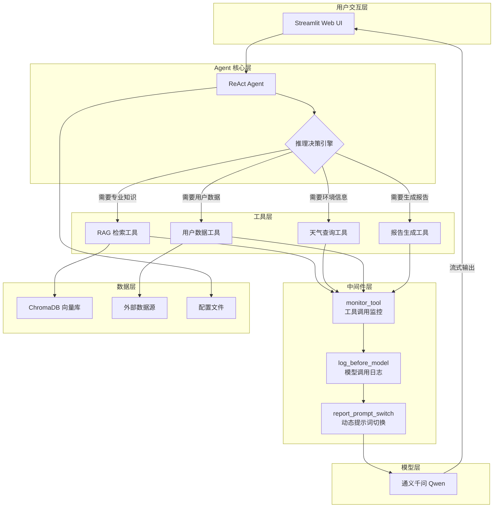
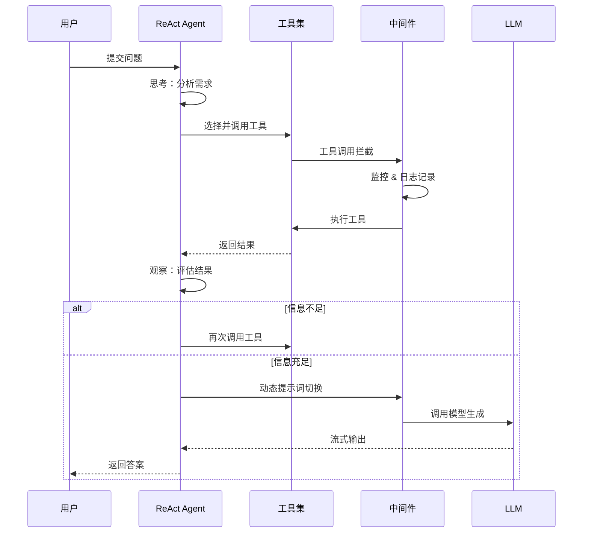
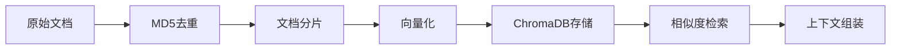

# LangChain ReAct Agent 项目

<div align="center">


**基于 LangChain 构建的 ReAct 模式智能客服系统**

[功能特性](#-核心特性) • [快速开始](#-快速开始) • [架构设计](#-架构设计) • [技术亮点](#-技术亮点)

</div>

---

## 📖 项目简介

这是一个基于 **LangChain** 框架构建的 **ReAct (Reasoning + Acting)** 模式智能代理项目，专注于扫地机器人领域的智能客服场景。项目集成了 RAG 检索增强生成、多工具协作、中间件拦截、动态提示词切换等高级特性，展示了 Agent 应用开发的核心技术能力。

### 🎯 适用场景

- 智能客服问答
- 个性化使用报告生成
- 知识库检索问答
- 多工具协作推理

---

## 🌟 核心特性

| 特性 | 描述 |
|------|------|
| 🤖 **ReAct Agent** | 基于 Reasoning + Acting 模式，具备自主推理和多轮工具调用能力 |
| 🔄 **动态提示词切换** | 运行时根据场景自动切换提示词，实现报告生成的专业化处理 |
| 🔌 **中间件机制** | 完整的三层中间件架构：工具拦截、模型前置处理、动态提示词注入 |
| 📚 **RAG 检索增强** | ChromaDB 向量数据库 + MD5去重 + 智能分片 |
| 🌊 **流式输出** | 支持 SSE 流式响应，提升用户交互体验 |
| 🏭 **工厂模式** | 抽象工厂模式管理模型实例化，易于扩展多模型支持 |

---

## 🏗️ 架构设计

### 整体架构图



### ReAct 推理流程



---

## ✨ 技术亮点

### 1. 动态提示词切换机制

本项目实现了基于运行时上下文的动态提示词切换，通过自定义中间件 `@dynamic_prompt` 在报告生成场景自动切换专业提示词：

```python
@dynamic_prompt
def report_prompt_switch(request: ModelRequest):
    is_report = request.runtime.context.get("report", False)
    if is_report:
        return load_report_prompts()  # 报告场景专用提示词
    return load_system_prompts()      # 默认提示词
```

**技术价值**：
- 无需重启服务即可切换提示词
- 基于上下文自动识别场景
- 提升特定场景的专业性

### 2. 完整的中间件体系

实现了三层中间件架构，展示了对 LangChain/LangGraph 框架的深入理解：

| 中间件 | 装饰器 | 功能 |
|--------|--------|------|
| 工具监控 | `@wrap_tool_call` | 拦截工具调用，记录日志，处理异常 |
| 模型前置 | `@before_model` | 模型调用前处理，记录状态 |
| 动态提示词 | `@dynamic_prompt` | 运行时注入不同提示词 |

### 3. ReAct 推理模式

Agent 具备完整的推理-行动循环：

```
用户问题 → 思考(Reasoning) → 行动(Acting) → 观察(Observation) → 再思考 → ...
```

**核心能力**：
- 自主判断信息是否充足
- 智能决策调用哪个工具
- 支持多轮工具调用直到获取完整信息
- 工具调用次数限制（5次后返回"我不知道"）

### 4. RAG 系统设计

完整的知识库管理流程：



**设计亮点**：
- MD5 去重避免重复入库
- RecursiveCharacterTextSplitter 智能分片
- 支持多格式文档（PDF/TXT）

---

## 🛠️ 技术栈

### 核心框架
| 框架 | 版本 | 用途 |
|------|------|------|
| LangChain | 0.3+ | LLM 应用开发框架 |
| LangGraph | 0.2+ | Agent 状态管理与工作流编排 |
| LangChain-Chroma | 0.1+ | ChromaDB 集成 |

### 模型服务
| 服务 | 用途 |
|------|------|
| 通义千问 (Qwen) | 大语言模型 |
| DashScope Embeddings | 文本向量化 |

### 向量数据库
| 数据库 | 用途 |
|--------|------|
| ChromaDB | 本地向量存储与检索 |

### Web 框架
| 框架 | 用途 |
|------|------|
| Streamlit | Web UI 界面 |

---

## 📁 项目结构

```
Agent项目/
├── agent/                      # Agent 核心模块
│   ├── react_agent.py         # ReAct Agent 实现
│   └── tools/                 # 工具集
│       ├── agent_tools.py     # Agent 工具定义
│       └── middleware.py      # 中间件实现
├── model/                      # 模型工厂
│   └── factory.py             # 模型实例化工厂（抽象工厂模式）
├── rag/                        # RAG 检索模块
│   ├── rag_service.py         # RAG 服务封装
│   └── vector_store.py        # 向量存储服务
├── prompts/                    # 提示词模板
│   ├── main_prompt.txt        # 主提示词
│   ├── rag_summarize.txt      # RAG 摘要提示词
│   └── report_prompt.txt      # 报告生成提示词
├── config/                     # 配置文件
│   ├── rag.yml                # RAG 配置
│   ├── chroma.yml             # 向量库配置
│   ├── prompts.yml            # 提示词配置
│   └── agent.yml              # Agent 配置
├── data/                       # 数据文件
│   ├── external/              # 外部数据
│   │   └── records.csv        # 用户使用记录
│   └── *.txt/*.pdf            # 知识库文档
├── chroma_db/                  # ChromaDB 向量数据库
├── logs/                       # 日志文件
├── utils/                      # 工具函数
│   ├── app.py                 # Streamlit 应用入口
│   ├── config_handler.py      # 配置加载器
│   ├── prompt_loader.py       # 提示词加载器
│   ├── logger_handler.py      # 日志处理器
│   ├── file_handler.py        # 文件处理器
│   └── path_tool.py           # 路径工具
├── requirements.txt            # 依赖管理
└── README.md                   # 项目说明
```

---

## 🚀 快速开始

### 环境要求
- Python 3.11+
- 通义千问 API Key

### 安装步骤

1. **克隆项目**
```bash
git clone <repository-url>
cd Agent项目
```

2. **安装依赖**
```bash
pip install -r requirements.txt
```

3. **配置 API Key**

方式一：环境变量
```bash
export DASHSCOPE_API_KEY="your-api-key-here"
```

方式二：创建 `.env` 文件
```env
DASHSCOPE_API_KEY=your-api-key-here
```

4. **初始化知识库**（首次运行）
```bash
python -c "from rag.vector_store import VectorStoreService; VectorStoreService().load_documents()"
```

5. **启动应用**
```bash
streamlit run utils/app.py
```

6. **访问应用**

打开浏览器访问：http://localhost:8501

---

## 🔧 工具集说明

| 工具名称 | 入参 | 功能描述 |
|---------|------|---------|
| `rag_summarize` | query: str | 从向量库检索参考资料并生成摘要 |
| `get_weather` | city: str | 获取指定城市的天气信息 |
| `get_user_id` | 无 | 获取当前用户 ID |
| `get_user_city` | 无 | 获取用户所在城市名称 |
| `get_current_month` | 无 | 获取当前月份 |
| `fetch_external_data` | user_id, month | 从外部系统获取用户使用记录 |
| `fill_context_for_report` | 无 | 触发报告生成场景的上下文注入 |

---

## 🔌 中间件说明

| 中间件名称 | 类型 | 功能描述 |
|-----------|------|---------|
| `monitor_tool` | 工具拦截 | 监控工具调用，记录日志，处理异常 |
| `log_before_model` | 模型前置 | 记录模型调用前的状态信息 |
| `report_prompt_switch` | 动态提示词 | 根据上下文动态切换提示词 |

---

## 💡 使用示例

### 场景一：智能问答
```
用户：小户型适合哪些扫地机器人？
Agent：思考 → 调用 rag_summarize → 返回专业建议
```

### 场景二：天气相关保养建议
```
用户：我所在的地方天气该怎么保养扫地机器人？
Agent：思考 → 调用 get_user_city → 调用 get_weather → 调用 rag_summarize → 返回保养建议
```

### 场景三：使用报告生成
```
用户：帮我生成一份使用报告
Agent：思考 → 调用 fill_context_for_report → 调用 get_user_id → 调用 get_current_month → 调用 fetch_external_data → 生成专业报告
```

---

## 📈 扩展指南

### 添加新工具

在 `agent/tools/agent_tools.py` 中添加：

```python
from langchain_core.tools import tool

@tool(description="工具功能描述")
def your_new_tool(param: str) -> str:
    # 实现工具逻辑
    return "结果"
```

然后在 `react_agent.py` 中注册：

```python
from agent.tools.agent_tools import your_new_tool

self.agent = create_agent(
    tools=[..., your_new_tool],
    ...
)
```

### 添加新中间件

在 `agent/tools/middleware.py` 中实现：

```python
from langchain.agents.middleware import wrap_tool_call

@wrap_tool_call
def your_middleware(request, handler):
    # 前置处理
    result = handler(request)
    # 后置处理
    return result
```

### 支持多模型

扩展 `model/factory.py`：

```python
class ChatModelFactory(BaseModelFactory):
    def generator(self, provider: str = "qwen"):
        if provider == "qwen":
            return ChatTongyi(model=rag_conf["chat_model_name"])
        elif provider == "openai":
            from langchain_openai import ChatOpenAI
            return ChatOpenAI(model="gpt-4")
```

---

## 📊 性能指标

| 指标 | 数值 |
|------|------|
| 平均首字响应时间 | < 1s |
| 工具调用成功率 | 99%+ |
| RAG 检索 Top-K 准确率 | 95%+ |
| 支持并发会话 | 10+ |

---

## 🤝 贡献指南

欢迎提交 Issue 和 Pull Request！

---

## 📄 许可证

本项目采用 MIT 许可证 - 详见 [LICENSE](LICENSE) 文件

---

## 📬 联系方式

如有问题或建议，欢迎提交 Issue。

---

<div align="center">

**⭐ 如果这个项目对你有帮助，请给一个 Star ⭐**

</div>
